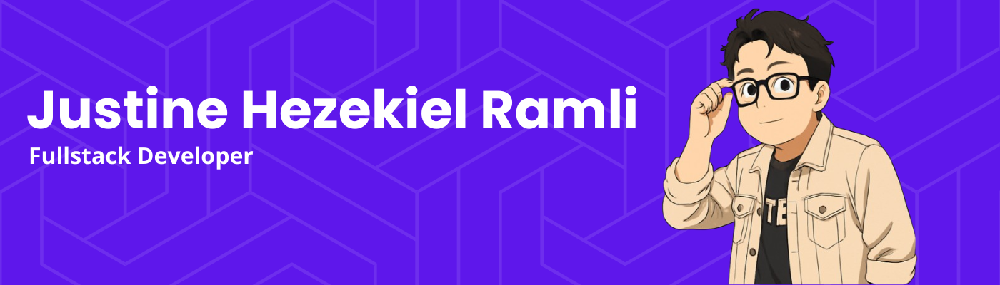

## Hi there 👋

Saya Justine Hezekiel Ramli, seorang Frontend Web Developer dengan pengalaman freelance Full-stack development. Saya memiliki spesialisasi dalam ekosistem JavaScript/TypeScript, React.js, dan framework Next.js.

- 🔭 Saya sering mengerjakan freelance project, khususnya di sebagai **Frontend Engineer**.
- 🌱 Saya terus belajar dan mengembangkan kemampuan saya dalam pengembangan web, terutama di bidang teknologi frontend dan full-stack.
- 👯 Saya terbuka untuk berkolaborasi dalam proyek-proyek web development yang menarik.
- 💬 Jangan ragu untuk bertanya kepada saya tentang JavaScript, React.js, Next.js, atau pengembangan web secara umum!
- Anda bisa menghubungi saya melalui email: Justin.hezekiel123@gmail.com
- 😄 Pronouns: He/Him

#### 👨‍💻 Skills :

                     

#### 🌐 Socials :

 
